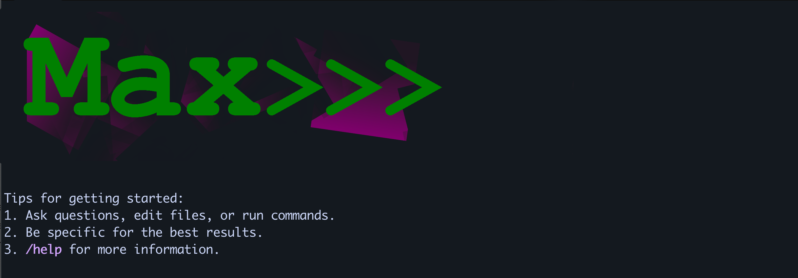

# Max Headroom CLI

 <!-- TODO: Update CI badge URL if repo/workflow name changes -->



This repository contains the Max Headroom CLI, a command-line AI workflow tool that connects to your
local AI models (e.g., via Ollama) and optionally to cloud-based models. It helps understand your code and accelerates your workflows in the APEN environment.

With the Max Headroom CLI you can:

- Query and edit large codebases within your model's context window.
- Generate new apps from PDFs or sketches, using multimodal capabilities if supported by your chosen model.
- Automate operational tasks.
- Use tools and MCP servers to connect new capabilities.

## Quickstart (for Closed environment)

1. **Prerequisites:**
    - Ensure you have [Node.js version 18](https://nodejs.org/en/download) or higher installed.
    - Have Ollama installed and running with your desired models (e.g., `ollama pull mistral`).
2. **Install Max Headroom CLI:**
   Obtain the `max-headroom-cli` package (e.g., as a `.tgz` file or from an internal npm registry) and install it globally:
   ```bash
   # Example from local tarball
   npm install -g ./max-headroom-cli-vX.Y.Z.tgz
   # Or from internal registry
   # npm install -g max-headroom-cli
   ```
3. **Run the CLI:**
   ```bash
   max-headroom
   ```
4. **Pick a color theme.**
5. **Authenticate:** When prompted, select "Ollama (Local)" and ensure your `OLLAMA_ENDPOINT` (and optionally `OLLAMA_MODEL`) environment variables are set correctly (e.g., in `~/.max_headroom/.env` or project `.max_headroom/.env`).

You are now ready to use the Max Headroom CLI with your local models!

## Examples

Once the CLI is running, you can start interacting with your configured AI model from your shell.

You can start a project from a new directory:

```sh
cd new-project/
max-headroom
> Write me a Max Headroom Discord bot that answers questions using a FAQ.md file I will provide
```

Or work with an existing project:

```sh
git clone <your-fork-url>/max-headroom-cli.git # TODO: Update clone URL
cd max-headroom-cli
max-headroom
> Give me a summary of all of the changes that went in yesterday
```

### Next steps

- Learn how to [contribute to or build from the source](./CONTRIBUTING.md).
- Explore the available **[CLI Commands](./docs/cli/commands.md)**.
- If you encounter any issues, review the **[Troubleshooting guide](./docs/troubleshooting.md)**.
- For more comprehensive documentation, see the [full documentation](./docs/index.md).
- Take a look at some [popular tasks](#popular-tasks) for more inspiration.

### Troubleshooting

Head over to the [troubleshooting](docs/troubleshooting.md) guide if you're
having issues.

## Popular tasks

### Explore a new codebase

Start by `cd`ing into an existing or newly-cloned repository and running `max-headroom`.

```text
> Describe the main pieces of this system's architecture.
```

```text
> What security mechanisms are in place?
```

### Work with your existing code

```text
> Implement a first draft for GitHub issue #123.
```

```text
> Help me migrate this codebase to the latest version of Java. Start with a plan.
```

### Automate your workflows

Use MCP servers to integrate your local system tools with your enterprise collaboration suite.

```text
> Make me a slide deck showing the git history from the last 7 days, grouped by feature and team member.
```

```text
> Make a full-screen web app for a wall display to show our most interacted-with GitHub issues.
```

### Interact with your system

```text
> Convert all the images in this directory to png, and rename them to use dates from the exif data.
```

```text
> Organise my PDF invoices by month of expenditure.
```

## Terms of Service and Privacy Notice

For details on the terms of service and privacy notice applicable to your use of Max Headroom CLI (especially when using local models), see the [Terms of Service and Privacy Notice](./docs/tos-privacy.md). If you optionally configure cloud services, their respective terms apply.
